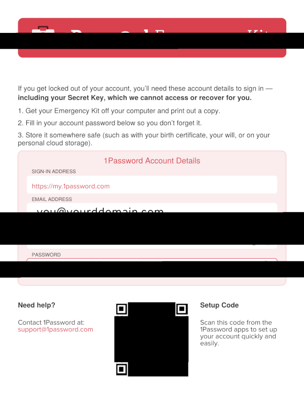
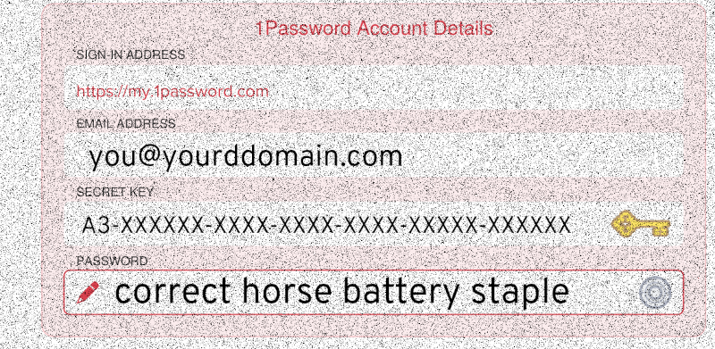
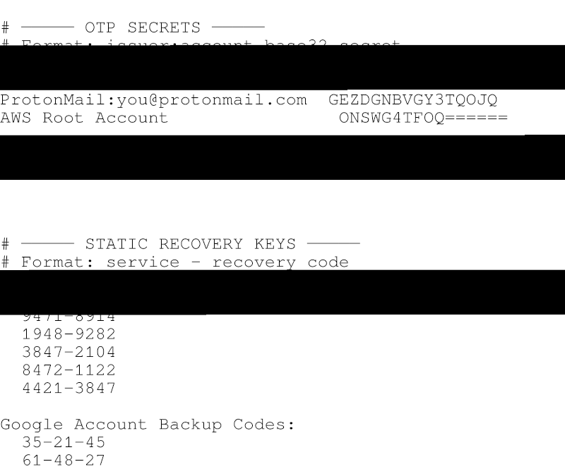
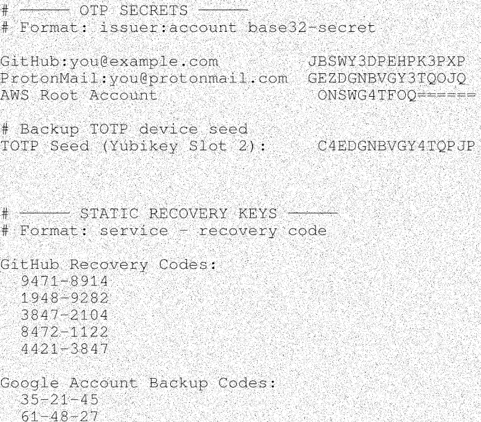

# General description

This repo contains a collection of personal scripts for creating resilient backups of sensitive data. The process intends to make weekly additions or changes to secrets safe and smooth. It emphasizes ease of use, recoverability, and uncompromising security at the cost of initial setup complexity and increased storage requirements.


## Why should you use it?

You probably shouldn’t — unless nothing else has worked well for you so far.  
But if you’re a bit paranoid about data loss, and still want to just drop secrets into a folder without thinking too much about it, this might help. Just be prepared to get your hands a bit dirty with customization.

And to be clear: Aside from using `age` (a modern best practice for file encryption), chunking (to reduce data loss if a file partially fails), and high default parity settings, there’s really only one unique selling point:

### Rasterization & spatial dispersion for aided recovery

Small secrets are impractical to chunk — even some PDFs are too small. So, they're rasterized into images. But losing just a few chunks can knock out enough pixel rows that even high-DPI secrets become unreadable.

**Shuffling** before encryption — and **unshuffling** after (filling in zeros for missing or incomplete chunks on the way) — makes rasterized secrets readable again, even with significant chunk loss.

#### Examples

*This 1password recovery might be difficult*


-----

*Recovered: grainy, but legible.*


-----

*Codes not readable*


-----

*Now we can recognize them*


-----

## Concepts & important considerations

The scripts use a single "age" public/private key pair for encryption and decryption. The private key is assumed to be GPG-encrypted and must be protected with a strong password or other robust mechanism. How this key is unlocked is the main and intended single point of failure.
* ⚠️ If access to the unlock secret is lost, recovery becomes impossible.
* ⚠️ If the unlock secret is exposed, content confidentiality is compromised.

Creating backups does not require the private key, so the risk of accidental exposure during routine use is low.

> One key to rule them all. Keep it secret. Keep it safe.

Avoid redundant encryption unless the other keys are either reliably memorable or also included in the backup. To prevent exposing plain text secrets, store them in a vault that is only mounted during backup operations (this is the default behavior). Ideally, the entire setup — scripts and vault — resides on a bootable USB stick used solely for periodic backups when keys have been added or changed.

## Summary workflow & recommendations

### Assumed setup

1. You store secrets in locked "containers" (e.g., password managers, encrypted OTP stores, LUKS-encrypted partitions) and ensure secure access for the backup process.
2. You created a **really** secret key to encrypt the age private key.
3. You followed the details of the [Setup instructions](#setup-instructions) below.

### Regular use

Periodically run `main.sh` to collect secrets, encrypt them, and upload them to backup locations. Physical backups (e.g., archive-quality optical media) are also recommended. See `write_dvd.sh` for guidance.

### Recovery

Run `decrypt.sh` from a backup location. Access to the secure key is essential. If any chunk errors are reported, run `par2 repair backup.par2` and `undisperse.sh`.

# Folder overview

* **`plain_staging/`**: Main drop-off folder for plaintext files or other secrets. Can be populated anytime but gets automatically cleared via `scripts/cleanup.sh` (run by default in `main.sh`). Ignored in `.gitignore`.
* **`keys/`**: Contains the main encryption/decryption key. All keys here should be encrypted and are safe to back up. Relevant copies are also placed in `encrypted/`. Additional helper secrets e.g. to upload to backup locations should reside here too.
* **`encrypted/`**: Stores encrypted outputs. These files are included in backups by default. Large files are excluded from git via `.gitignore`.
* **`plain_recovered/`**: Created during decryption. Also ignored in `.gitignore`.


# General usage

The overall workflow can be accessed via `scripts/main.sh`, which chains together these steps:

* Collecting secrets
* Rasterizing text and pdf files, shuffling pixels
* Encrypting with `age`
* Adding parity blocks with `par2`
* Verifying integrity
* Uploading to backup destinations
* Cleaning up staging folder

The scripts assume Linux command-line proficiency and requires customization. For example:

* `scripts/collect.sh`: Adjust source directories to your environment.
* `scripts/encrypt.sh`: Set correct path to the `age` public key.
* `scripts/verify.sh`: Define required files for verification.
* `scripts/backup.sh`: Modify remote targets and credentials.

> ⚠️ This is a set of intermediate level scripts tailored for personal use. It is **not** a plug-and-play solution. Several commands (e.g., `myvault unlock`) are expected to be provided or adapted by the user.

---

# Setup instructions

1. **Install required tools**
   Ensure these commands are installed: `age`, `gpg`, `par2`, `magick`, `pdftoppm`, `git`, `rclone`, `rsync`, `pkexec`, `mdadm`, `cryptsetup`, `ykchalresp`, `mkisofs`, `growisofs`, `dvd+rw-mediainfo`, `dvd+rw-format`, `bc`, `xxd`, `pv`, `python3`

2. **Provide missing helpers**
   Scripts call `myvault` and `myraid` via `pkexec`. Supply equivalents or modify commands.

3. **Create & verify key files**
   Place the encrypted private key (`backup_age.key.gpg`) and plaintext public key (`backup_pub.age`) in `keys/`. Run `keys/key_to_pgm.sh` to generate Base64 and PGM variants. These will be automatically included during encrypt runs in `encrypted/`.

4. **Add required support files**
   Ensure the following files exist: `b2-security-backups-write.env.gpg`, and `rclone.conf.gpg` or comment out their usage in the respective sections of `backup.sh`

5. **Customize the setup**
   Adjust paths and filenames as indicated in the scripts via ` # Instruction:` comments (e.g. in `collect.sh`, `backup.sh`, `verify.sh`).

6. **Check helper scripts**
   Ensure all referenced utilities (e.g., vault/RAID helpers) are present and working.

7. **Verify setup**
   Run `check_setup.sh` for a sanity check but do not rely on it blindly.

8. **Test key decryption**
   Confirm you can decrypt `backup_age.key.gpg`. Ensure the unlocking passphrase is memorable and secure.

9. **Set up git (Optional)**
   You might want your encrypted secrets in a private git repo. You'll need to initialize it yourself.
   Choose whether to track the full scope of folders or `encrypted/` only. Validate that `git` commands in `backup.sh` behave as you intend.

10. **Scan for secret leaks**
    Run `git status` and manually inspect `keys/`, `scripts/`, and `encrypted/` to ensure no plaintext secrets are committed (especially `backup_age.key`).

11. **Run `main.sh`**
    Select the `m` option in the menu. If errors occur, clean `plain_staging/` and `encrypted/`. Debug by running `collect.sh`, `rasterize.sh`, `addparity.sh`, `verify.sh`, `backup.sh`, and `cleanup.sh` step-by-step.
    Often you can also re-run without cleaning but that is not recommend after the setup works.

12. **Test decryption and recovery**
    Run `decrypt.sh` and see your decrypted files in `plain_recovered`. 
    Running `undisperse.sh` from within `encrypted/` you should then see `.pgm` and `.ppm` images become viewable.

---

## Minimal setup for decryption

To restore data on a recovery machine, you only need the following tools:

* `gpg` – decrypts the private key
* `age` – decrypts files
* `python3` – runs `assemble_chunks.py` and `shuffle_netpbm.py`
* Core utilities – e.g., `sha256sum`, `find`

Once installed, run:

```bash
decrypt.sh
undisperse.sh
```

This should recover the original files, assuming the backup key and parity blocks are intact.

# Known issues

- `undisperse.sh` / `shuffle_netpbm.py` ignore `--seed` during decoding and only read from filename.
- `shuffle_netpbm.py` Throws some warnings on theoretically undamage file. Restoration still works so no biggie.
- `decrypt.sh` folder path is hard-coded so be aware when renaming `encrypted` directory.
